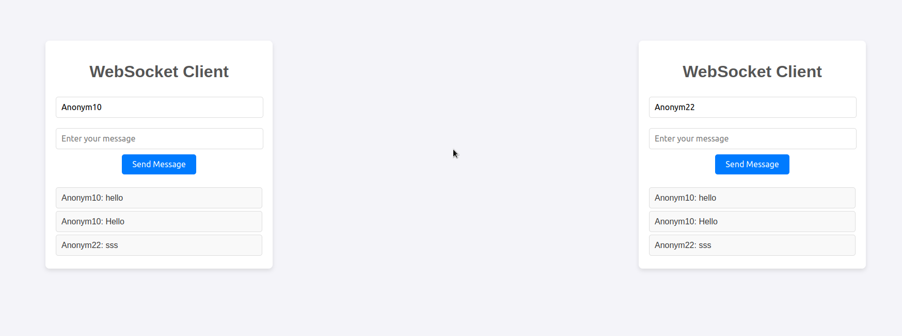

**Understanding WebSockets**
It starts as an HTTP connection and then "upgrades" to a WebSocket connection
Here's a summary of the key steps:

1. The client sends a WebSocket handshake request (an HTTP request with specific headers).
2. The server responds with a handshake response, completing the WebSocket protocol upgrade
3. Once the connection is established, both client and server can send and receive messages without needing to reopen the connection.

**Starting server**
```
    go run server.go  
```


